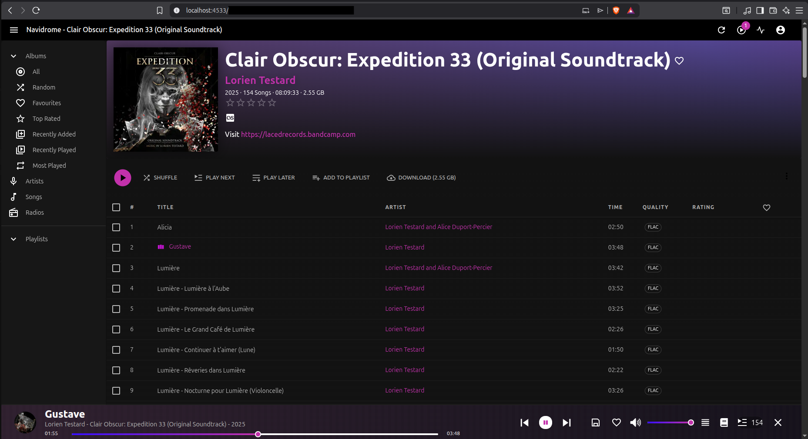
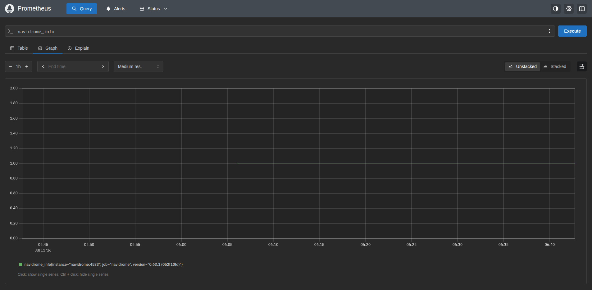
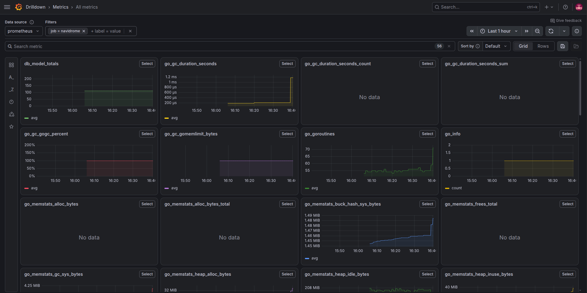

# 💾 Media Server

This is project where I set up an Ubuntu media server to learn **Docker**, **Prometheus**, and **Grafana**.
As such, all services are deployed using Docker and monitored using Prometheus & Grafana.
All services are also deployed based on the official documentation, unless specified.
The services were also all stored under the `/opt/` folder, where optional software are stored traditionally.
I expect the server to grow as I spend more time setting it up.

## 🏗️ Specs
- Ubuntu 24.04 LTS
- Dell Precision 3490 laptop
- Intel® Core™ Ultra 5 135H × 18
- 32GB RAM
- 1TB storage

## 🗃️ Containers & services
1. [Navidrome](#-navidrome)
2. [Prometheus & Grafana](#-prometheus--grafana)

## 🎸 Navidrome

Navidrome is a service that serves music files of many formats, including FLAC, which makes up the bulk of my digital music library.
I created `docker-compose.yml` based on the official documentation, only changing the path to my volumes and uncommenting `ND_LOGLEVEL` as such:
```
services:
  navidrome:
    image: deluan/navidrome:latest
    user: 1000:1000 # should be owner of volumes
    ports:
      - "4533:4533"
    restart: unless-stopped
    environment:
      # Optional: put your config options customization here. Examples:
      ND_LOGLEVEL: debug
    volumes:
      - "/path/to/data:/data"
      - "/path/to/your/music/folder:/music:ro"
```

Since I had the error `No configuration file found. Loaded configuration only from environment variables` using the default settings, I changed the user from `1000` (me) to `0` (root), which solved the error.
This means that only root has permissions to modify the folder.
To fix this issue, I ran the following to give myself (user `1000`) ownership of the folder, in order to make recursive changes, i.e. to all files within the directory:
```
sudo chown -R 1000:1000 /opt/navidrome
```
where `1000:1000` stands for `<user-id>:<group-id>`.

To confirm that it is running, navigate to `localhost:4533` (or you custom port) on the local machine:



To stream from another device on the same network, you can find the server's IP address by running `hostname -I`, and then navigating to `<ip-address>:4533`:


You can also run the following to check the status of your containers:
```
$ docker ps
CONTAINER ID   IMAGE                     COMMAND            CREATED         STATUS         PORTS                                         NAMES
b0a5926ca179   deluan/navidrome:latest   "/app/navidrome"   2 minutes ago   Up 2 minutes   0.0.0.0:4533->4533/tcp, [::]:4533->4533/tcp   navidrome-navidrome-1
```

## 🚥 Prometheus & Grafana

Prometheus is a great tool for monitoring server traffic and activity to maintain uptime. In combination with Grafana, they make a great monitoring stack by automatically plotting graphs, where Prometheus serves as the backend and Grafana serves as the frontend interface.

Before building the services, I created an internal network for the containers to talk to each other:
```
docker network create metrics-network
```

You should be able to see `metrics-network` by running:
```
docker network ls
```

After than, I installed Prometheus using the following YAML script, remembering to define and enable external networks:
```
services:
  prometheus:
    container_name: prometheus
    image: prom/prometheus:latest
    ports:
      - "9090:9090"
    restart: unless-stopped
    volumes:
      - ./prometheus.yml:/etc/prometheus/prometheus.yml
      - ./data:/opt/prometheus
    networks:
      - metrics-network
networks:
  metrics-network:
    external: true
```

I then installed Grafana with the environmental variables `GF_AUTH_ANONYMOUS` to bypass the login screen. Remember to define and enable external networks:
```
services:
  grafana:
    image: grafana/grafana:latest
    environment:
      - GF_AUTH_ANONYMOUS_ENABLED=true
      - GF_AUTH_ANONYMOUS_ORG_NAME=Main Org.
      - GF_AUTH_ANONYMOUS_ORG_ROLE=Viewer
    ports:
      - "3000:3000"
    networks:
      - metrics-network
networks:
  metrics-network:
    external: true
```

### Monitoring Navidrome

Luckily for me, the maintainers of Navidrome has already been configured the service to work with Prometheus.

To enable Prometheus in Navidrome, simply add the following to `docker-compose.yml` of Navidrome and then rebuild. And remember to define and enable external networks:
```
ND_PROMETHEUS_ENABLED=true
```

In the folder where I stored Prometheus's docker compose script, I created another YAML `prometheus.yml` to connect it to the services' endpoints for metric collection. It looks something like this:
```
global:
  scrape_interval: 60s
scrape_configs:
  - job_name: 'navidrome'
    metrics_path: /metrics
    scheme: http
    static_configs:
      - targets: ['navidrome:4533']
```

As you add more services to your server, you can add more jobs to this script to allow monitoring.

Now if all containers are communicating with eath other as expected, you should able to query `navidrome_info` on `localhost:9090`:



Not very pretty, which is where Grafana comes in. To add Prometheus as a data source to Grafana, go to Connections -> Data source -> Add data source and choose Prometheus. Configure the correct port and save. Since all services live in isloated containers, I used `prometheus:9090` instead of `localhost:9090`. Finally, navigate to Drilldown -> Metrics to see your graphs:



You can then filter for instances, status, etc. as well as customising the panels.